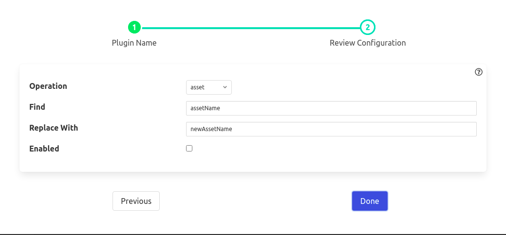

.. Images

Rename Filter
==============

The *fledge-filter-rename* filter that can be used to modify the name of an asset, datapoint or both. It may be used either in *South* services or *North* services or *North* tasks.

To add a Rename filter

  - Click on the Applications add icon for your service or task.

  - Select the *rename* plugin from the list of available plugins.

  - Name your Rename filter.

  - Click *Next* and you will be presented with the following configuration page

  - Configure the plugin

+-----------+
| |rename|  |
+-----------+

    - **Operation**: Search and replace operation be performed on asset name, datapoint name or both

    - **Find**: A regular expression to match for the given operation

    - **Replace With**: A substitution string to replace the matched text with

  - Enable the filter and click on *Done* to activate it

Example
-------

The simplest following example perform on given below reading object

.. code-block:: JSON

    {
        "readings": {
            "sinusoid": -0.978147601,
            "a": {
                "sinusoid": "2.0"
            }
        },
        "asset": "sinusoid",
        "id": "a1bedea3-8d80-47e8-b256-63370ccfce5b",
        "ts": "2021-06-28 14:03:22.106562+00:00",
        "user_ts": "2021-06-28 14:03:22.106435+00:00"
    }

1. To replace an asset apply a configuration would be as follows

* Operation    : asset
* Find         : sinusoid
* Replace With : sin

**Output**

.. code-block:: JSON

    {
        "readings": {
            "sinusoid": -0.978147601,
            "a": {
                "sinusoid": 2.0
            }
        },
        "asset": "sin",
        "id": "a1bedea3-8d80-47e8-b256-63370ccfce5b",
        "ts": "2021-06-28 14:03:22.106562+00:00",
        "user_ts": "2021-06-28 14:03:22.106435+00:00"
    }

2. To replace a datapoint apply a configuration would be as follows

* Operation    : datapoint
* Find         : sinusoid
* Replace With : sin

**Output**

.. code-block:: JSON

    {
        "readings": {
            "sin": -0.978147601,
            "a": {
                "sin": 2.0
            }
        },
        "asset": "sinusoid",
        "id": "a1bedea3-8d80-47e8-b256-63370ccfce5b",
        "ts": "2021-06-28 14:03:22.106562+00:00",
        "user_ts": "2021-06-28 14:03:22.106435+00:00"
    }

3. To replace both asset and datapoint apply a configuration would be as follows

* Operation    : both
* Find         : sinusoid
* Replace With : sin

**Output**

.. code-block:: JSON

    {
        "readings": {
            "sin": -0.978147601,
            "a": {
                "sin": 2.0
            }
        },
        "asset": "sin",
        "id": "a1bedea3-8d80-47e8-b256-63370ccfce5b",
        "ts": "2021-06-28 14:03:22.106562+00:00",
        "user_ts": "2021-06-28 14:03:22.106435+00:00"
    }
